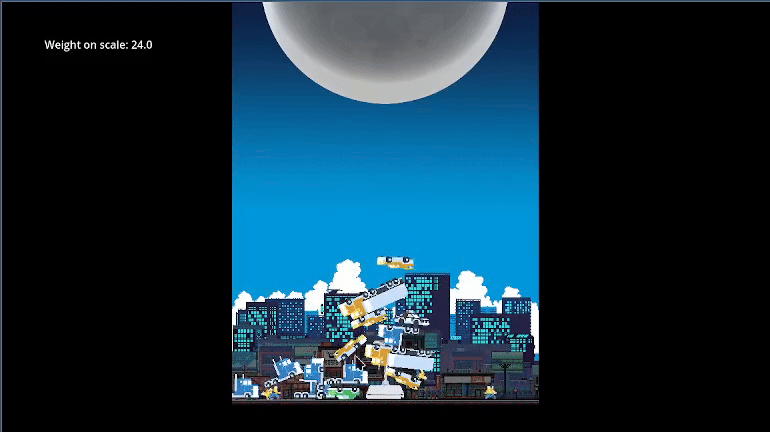

# Portfolio Godot

Meus Projetos em Godot

---

#### Third Person Character

Projeto para demonstrar habilidades com state machines, câmera em terceira pessoa, controle de personagem (mover, pular, correr, mirar, etc), colisão com cenário e mais. 

*Demonstração do personagem em estados de sprint (utilizando state machine para alternar entre idle, walk e sprint)*

*Demonstração do personagem realizando pulos (utilizando state machine para jump em idle, walk e sprint), o pulo é configurado para ocorrer apenas na direção em que foi ativado.*

---

#### Isometric Character

Projeto para demonstrar habilidades com signals, animações básicas, câmera isométrica e UI simples.

---

#### GMTK 2024 GameJam - Put Them On The Scale
*Aviso legal: Nenhum asset presente neste projeto é de minha autoria. Todos os créditos vão para os seguintes criadores: Kenney, GrafxKid e Craftpix.net*

Projeto entregue à GameMaker's Toolkit GameJam 2024 - [página do itch.io - Put Them On The Scale](https://itch.io/jam/gmtk-2024/rate/2889944)

*Demonstração de trabalho com objetos de física em 2D, signals, layering de assets, colisão em 2D, agrupamento e uso de área para detecção*

